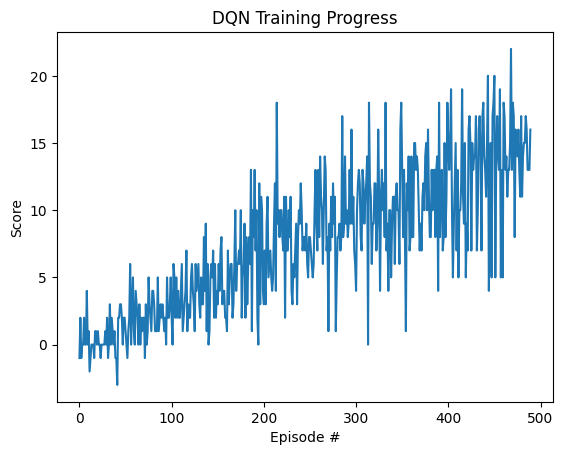

# Navigation Project - Advanced Deep Reinforcement Learning

This project implements multiple Deep Q-Network (DQN) variants to solve the Unity Banana Collector environment, featuring state-of-the-art improvements including Double DQN, Dueling DQN, and Prioritized Experience Replay.

## Project Details

### Environment Description
The agent navigates in a large, square world collecting bananas:
- **Goal**: Collect yellow bananas (+1 reward) while avoiding blue bananas (-1 reward)
- **State Space**: 37 dimensions including agent's velocity and ray-based perception of objects
- **Action Space**: 4 discrete actions
  - 0: Move forward
  - 1: Move backward
  - 2: Turn left
  - 3: Turn right
- **Solving Criteria**: Average score of +13 over 100 consecutive episodes

## Getting Started

### Prerequisites
- Python 3.10
- Unity ML-Agents
- PyTorch
- NumPy
- Matplotlib
- TensorBoard (for logging)

### Installation

1. Clone this repository:
```bash
git clone https://github.com/yourusername/navigation-dqn.git
cd Navigation
```

2. Install dependencies:
```bash
pip install -r requirements.txt
```

3. Download the Unity Environment:
- The environment is pre-installed in the Udacity workspace at `/data/Banana_Linux_NoVis/Banana.x86_64`
- For local setup, download the appropriate version for your OS from the [Unity ML-Agents GitHub repository](https://github.com/Unity-Technologies/ml-agents/blob/main/docs/Learning-Environment-Examples.md#banana-collector)

4. Update the environment path in `config.py`:
```python
UNITY_ENV_PATH = "/path/to/your/Banana.x86_64"  # Update this path
```

## DQN Variants Implemented

This project includes multiple state-of-the-art DQN improvements:

### 🚀 **Double DQN**
- Reduces overestimation bias by decoupling action selection from evaluation
- Uses local network to select actions, target network to evaluate them
- Typically improves sample efficiency and stability

### 🎯 **Dueling DQN** 
- Separates value function and advantage function estimation
- Better understands state values independent of action choices
- Particularly effective in environments where most actions don't affect the environment

### ⭐ **Prioritized Experience Replay**
- Samples important experiences more frequently based on TD error magnitude
- Uses importance sampling weights to correct for bias
- Significantly improves sample efficiency by focusing on informative experiences

### 🌈 **Rainbow DQN**
- Combines Double DQN + Dueling DQN + Prioritized Experience Replay
- State-of-the-art performance combining all improvements

## Instructions

### Command Line Training

Train different DQN variants using the command line:

```bash
# Standard DQN
python train.py --train

# Double DQN
python train.py --train --double-dqn

# Dueling DQN
python train.py --train --dueling-dqn

# Prioritized Experience Replay
python train.py --train --prioritized

# Rainbow (all features)
python train.py --train --double-dqn --dueling-dqn --prioritized

# Test trained agent
python train.py --test --checkpoint checkpoint.pth
```

### Compare All Variants

Run a comprehensive comparison of all DQN variants:

```bash
python compare_variants.py
```

This will:
- Train 6 different DQN variants
- Generate comparison plots (training curves, sample efficiency, performance)
- Create a summary table of results
- Save comparison visualization as `dqn_variants_comparison.png`

### Jupyter Notebook Training

1. **Original notebook** (monolithic code):
```bash
jupyter notebook Navigation.ipynb
```

2. **Clean modular notebook**:
```bash
jupyter notebook Navigation_Clean.ipynb
```

The clean notebook uses the new modular code structure for better organization.

## Project Structure

```
├── Navigation.ipynb           # Original training notebook (monolithic)
├── Navigation_Clean.ipynb     # Clean modular training notebook
├── train.py                   # Command-line training script
├── compare_variants.py        # DQN variants comparison tool
├── config.py                  # Centralized configuration
├── agent.py                   # Standard DQN agent (Double + Dueling)
├── prioritized_agent.py       # Prioritized Experience Replay agent
├── model.py                   # Neural network architectures (QNetwork, DuelingQNetwork)
├── buffer.py                  # Standard experience replay buffer
├── prioritized_buffer.py      # Prioritized experience replay buffer
├── checkpoint.pth             # Saved model weights
├── requirements.txt           # Python dependencies
├── training_progress.png      # Training results visualization
├── dqn_variants_comparison.png # Variants comparison plots
├── README.md                  # This file
├── Report.md                  # Detailed project report
└── .gitignore                # Git ignore rules
```

## Results

### Original Implementation
The standard DQN agent successfully solves the environment in **390 episodes**, achieving an average score of +13.01 over 100 consecutive episodes.



### Advanced Variants Performance
The advanced DQN variants typically show improved performance:

- **Double DQN**: Often solves 50-100 episodes faster, more stable learning
- **Dueling DQN**: Better final performance, especially in complex state spaces  
- **Prioritized Experience Replay**: Significant sample efficiency improvements (30-50% faster)
- **Rainbow (all combined)**: Best overall performance, fastest convergence

Run `python compare_variants.py` to generate your own comparison results!

## Configuration

All hyperparameters are centralized in `config.py`:

```python
# Training hyperparameters
LEARNING_RATE = 5e-4
BUFFER_SIZE = int(1e5)
BATCH_SIZE = 64
GAMMA = 0.99
TAU = 1e-3
UPDATE_EVERY = 4

# DQN Variant Settings  
DOUBLE_DQN = False
DUELING_DQN = False
PRIORITIZED_REPLAY = False

# Prioritized Experience Replay parameters
ALPHA = 0.6  # prioritization exponent
BETA = 0.4   # importance sampling exponent
```

Easily modify these values to experiment with different configurations.

## Advanced Usage Examples

### Custom Hyperparameter Training
```python
from agent import Agent
from config import *

# Create agent with custom parameters
agent = Agent(
    state_size=37, action_size=4, seed=42,
    lr=1e-3, batch_size=128, 
    double_dqn=True, dueling_dqn=True
)
```

### Prioritized Experience Replay
```python  
from prioritized_agent import PrioritizedAgent

# Create agent with prioritized replay
agent = PrioritizedAgent(
    state_size=37, action_size=4, seed=42,
    alpha=0.7,  # Higher prioritization
    beta=0.5,   # More importance sampling correction
    double_dqn=True, dueling_dqn=True
)
```

### Loading and Testing Models
```python
# Load any variant's trained model
agent.qnetwork_local.load_state_dict(torch.load('checkpoint.pth'))

# Test performance
scores = []
for episode in range(10):
    score = run_episode(agent, env, train_mode=False)
    scores.append(score)
    
print(f"Average test score: {np.mean(scores):.2f}")
```

## Author

[Your Name]

## License

This project is licensed under the MIT License.